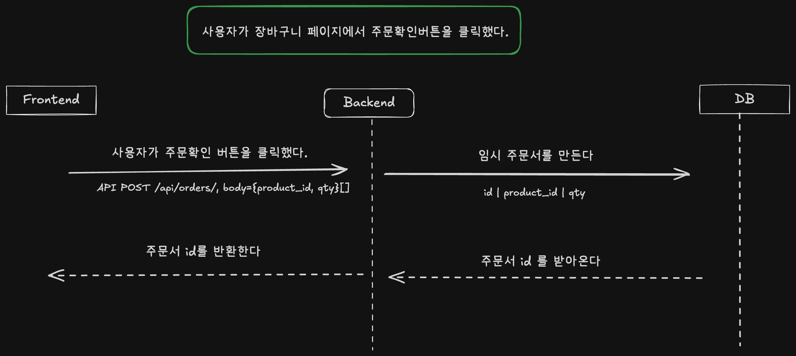
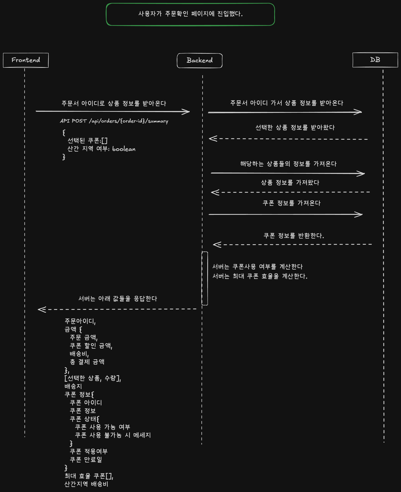
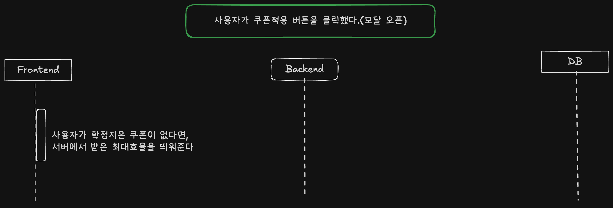
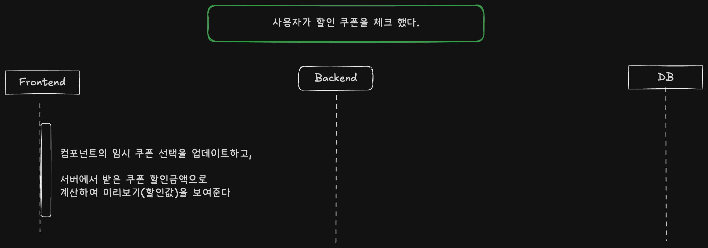
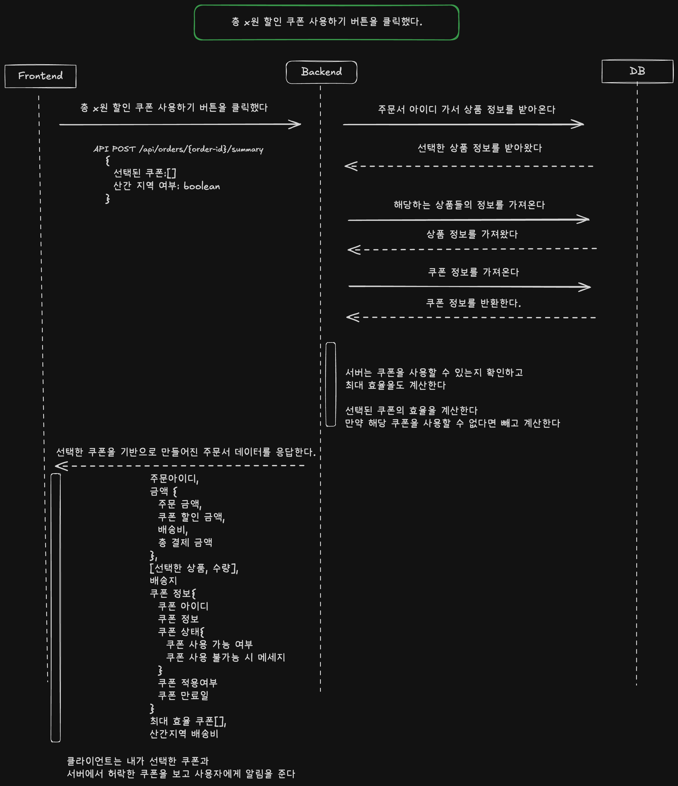
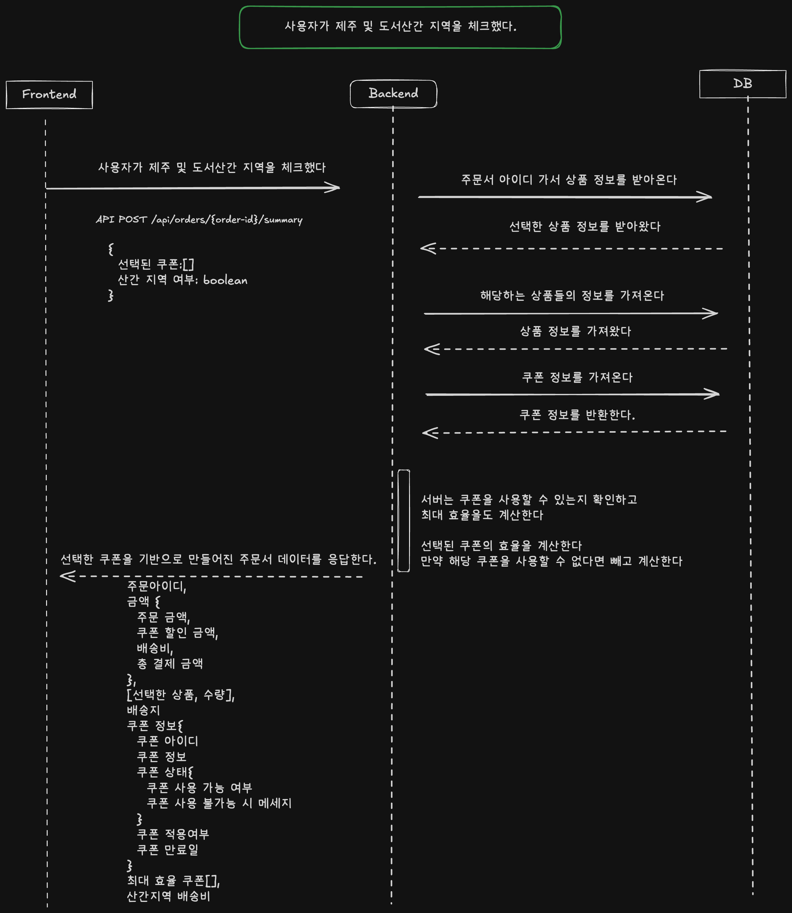
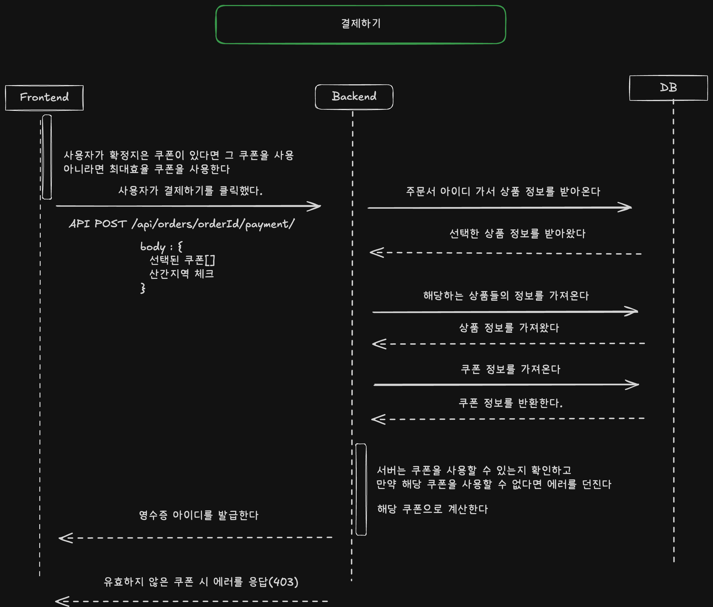

## 소개

### 변경 전

장바구니라는 도메인에서 결제하기와 같이 데이터가 중요한 부분에서는 최대한 DB와의 소통을 통해 정합성을 챙기려고했습니다.

그래서 할인쿠폰이나 도서산간 지역 체크를 주문서에 포함시켜 DB에 저장하도록 했습니다.

최대한 클라이언트의 이벤트를 중심으로 다이어그램을 작성하였습니다

### 변경 후

클라이언트에 산간 선택과 쿠폰 선택의 책임을 가지도록 변경했습니다.

첫 진입 시 선택된 장바구니를 서버에 저장하고 그 주문서를 사용하여 계산을 진행합니다

클라이언트에 상태를 둠으로서 총 세개의 API를 두 게 되었습니다.

1. 첫 진입 시 임시 주문서 생성
2. 요청 시 해당 주문서의 계산 결과, 쿠폰 등 필요한 정보 생성
3. 결제 후 영수증 발행

## 사용자가 장바구니 페이지에서 주문 확인 버튼을 클릭했다.

## 사용자가 주문확인 페이지에 진입했다.

## 사용자가 쿠폰적용 버튼을 클릭했다.(모달 오픈)

## 사용자가 할인 쿠폰을 체크 했다.

## 총 x원 할인 쿠폰 사용하기 버튼을 클릭했다.

## 사용자가 제주 및 도서산간 지역을 체크했다.

## 결제하기

---
