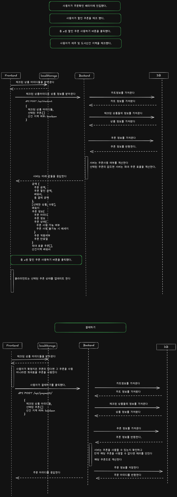

## 소개

### 변경 전

장바구니라는 도메인에서 결제하기와 같이 데이터가 중요한 부분에서는 최대한 DB와의 소통을 통해 정합성을 챙기려고했습니다.

그래서 할인쿠폰이나 도서산간 지역 체크를 주문서에 포함시켜 DB에 저장하도록 했습니다.

최대한 클라이언트의 이벤트를 중심으로 다이어그램을 작성하였습니다

### 변경 후

- 클라이언트에 산간 지역 선택과 쿠폰 선택의 책임을 가지도록 변경했습니다.
- 장바구니 페이지에서 생성된 선택된 체크리스트와 장바구니를 이용하였습니다.
- 하나의 api 로 주문서의 변경을 처리하도록 했습니다.

## 시퀀스 다이어그램

